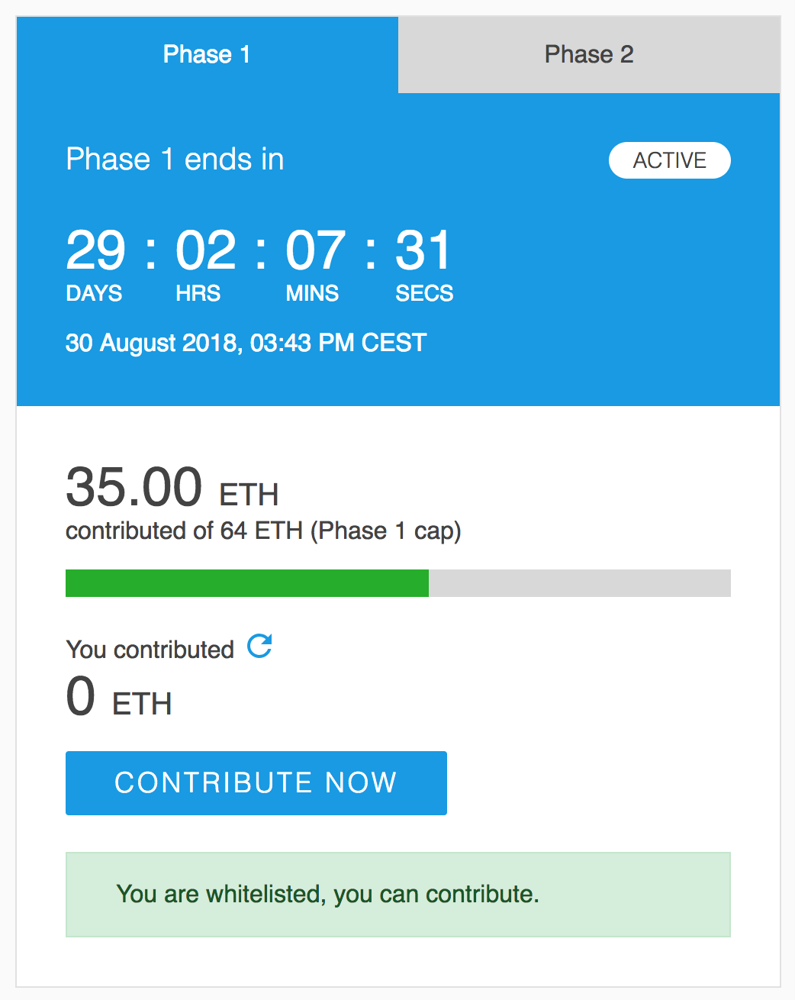

# React crowdsale contribution module

A crowdsale contribution module that was used for seed crowdsales on cofound.it. The extracted component has a countdown, contributed ETH sum, dates, terms of service checks, support multiple phases and allows user whitelisting.

The TOS confirmation is saved in the browsers local storage, delete it to start over when testing.

This demo uses the [puding](https://github.com/cofablab/puding)



## Usage

```
git clone git@github.com:cofablab/crowdsale-module.git
cd crowdsale-module
yarn install
yarn start
```

###### Install dependencies with

```
yarn install
```

###### Run development

```
yarn start
```

###### Build bundle

```
yarn build
```

## Configuration

Demo mock data declared in `src/pages/Home/index.js`

```
{
      slug: 'primary',
      user: {
        anonymous: false,
        wallet: {
          wallet_type: 'ledger',
          wallet_address: '0x6BD61c584a851F582780Db4029799ebe96283C0a',
        },
      },
      guest: false,
      crowdsale: {
        contribution_address: '0xa558475680f0FAFd6048B702b9334344236F86b4',
        phases: [
          {
            pending: false,
            active: true,
            is_published: true,
            label: 'Phase 1',
            startTimeTo: 2513251235, // implement your own time feed function
            start_date: '2018-06-23T13:43:44.000000Z',
            endTimeTo: 2513251235, // implement your own time feed function
            end_date: '2018-08-30T13:43:44.000000Z',
            total_eth_contributed: 35,
            phase_cap: 64,
          },
          {
            pending: true,
            active: false,
            passed: false,
            label: 'Phase 2',
            startTimeTo: 2513251235, // implement your own time feed function
            start_date: '2018-08-30T13:43:44.000000Z',
            endTimeTo: 2513251235, // implement your own time feed function
            end_date: '2018-08-30T13:43:44.000000Z',
            total_eth_contributed: 64,
            phase_cap: 64,
          },
        ],
      },
      computed: {
        isWhitelisted: true,
      },
    }
```

## Structure

```
crowdsale-module
├── public
│   ├── favicon.ico
│   ├── index.html
│   └── manifest.json
├── src
│   ├── admin
│   ├── assets
│   │   ├── uploads
│   │   ├── close_black.svg
│   │   ├── logo.svg
│   │   └── refresh_white.svg
│   ├── components
│   │   ├── AnimatedNumber
│   │   │   └── index.js
│   │   ├── BaseLink
│   │   │   └── index.js
│   │   ├── Checkbox
│   │   │   ├── index.js
│   │   │   └── styled.js
│   │   ├── ContributionModal
│   │   │   ├── index.js
│   │   │   └── styled.js
│   │   ├── Countdown
│   │   │   ├── __tests__
│   │   │   │   └── index.test.js
│   │   │   ├── index.js
│   │   │   └── styled.js
│   │   ├── CrowdsaleInfo
│   │   │   ├── index.js
│   │   │   └── styled.js
│   │   ├── EthIcon
│   │   │   └── index.js
│   │   ├── Popup
│   │   │   ├── index.js
│   │   │   └── styles.scss
│   │   ├── ProgressBar
│   │   │   └── index.js
│   │   ├── SVG
│   │   │   └── index.js
│   │   ├── styled
│   │   │   └── index.js
│   │   └── style.json
│   ├── content
│   │   └── articles
│   ├── helpers
│   │   ├── BlockchainClient.js
│   │   ├── constants.js
│   │   ├── css.js
│   │   ├── index.js
│   │   ├── localStorage.js
│   │   └── validators.js
│   ├── pages
│   │   └── Home
│   │       └── index.js
│   ├── style
│   │   ├── helpers.sass
│   │   └── settings.scss
│   ├── App.js
│   ├── App.scss
│   ├── App.test.js
│   ├── index.js
│   ├── index.scss
│   └── registerServiceWorker.js
├── README.md
├── package.json
├── screenshot.png
└── yarn.lock
```

## License

MIT © [Cofab](https://github.com/cofablab)
